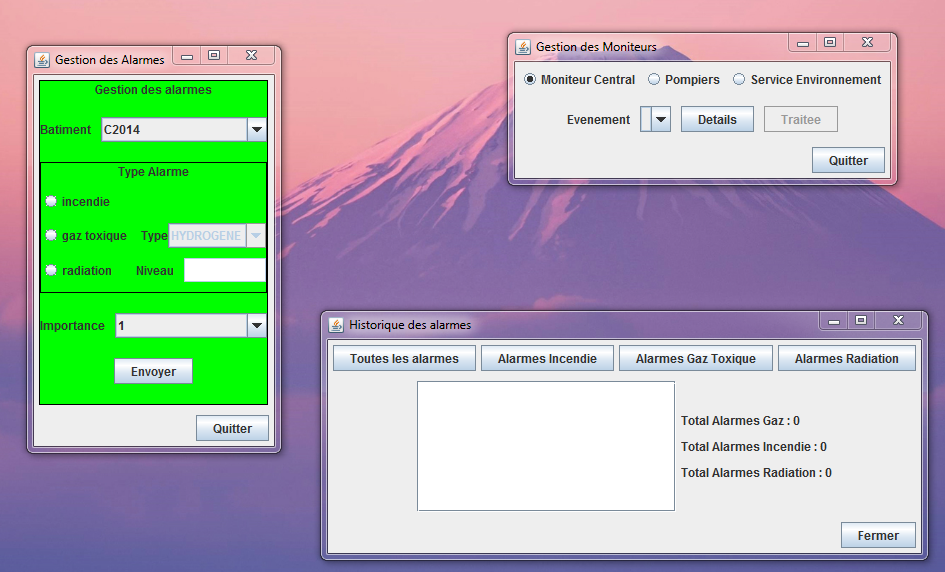
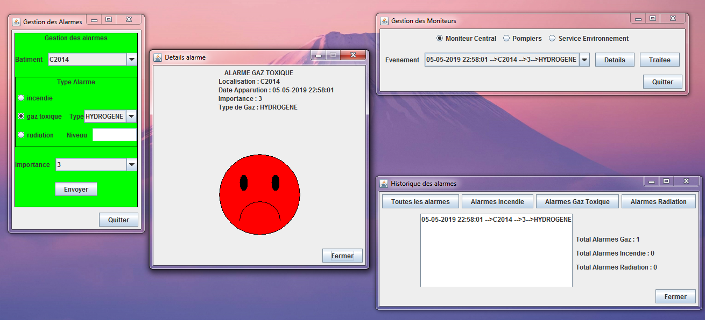

# Alarms Monitoring
Set up an alarm management system equipped with
different sensors (fire, radioactive gas, etc.).
Once an incident is detected, the different
departments are automatically informed with all
required information (the building, the room, etc...)
  

  
 

  

  
 

